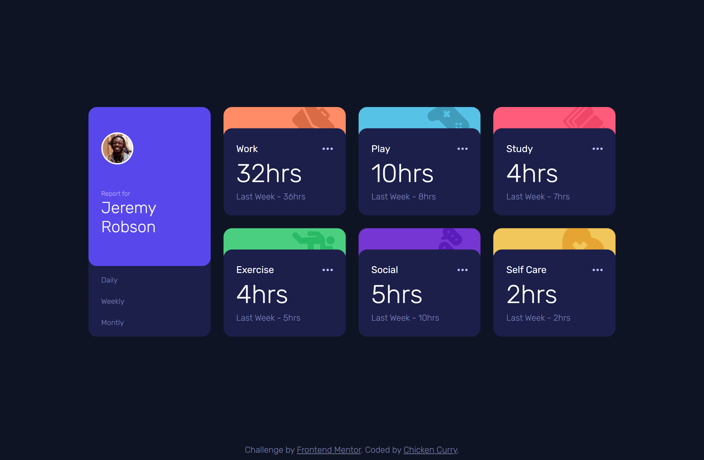
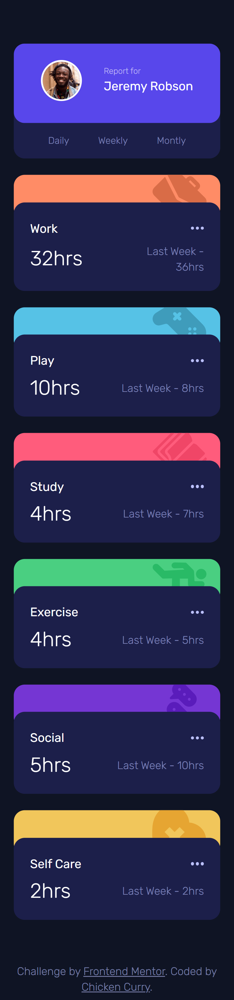

# Frontend Mentor - Time tracking dashboard solution

This is a solution to the [Time tracking dashboard challenge on Frontend Mentor](https://www.frontendmentor.io/challenges/time-tracking-dashboard-UIQ7167Jw). Frontend Mentor challenges help you improve your coding skills by building realistic projects. 

## Table of contents

- [Overview](#overview)
  - [The challenge](#the-challenge)
  - [Screenshot](#screenshot)
  - [Links](#links)
- [My process](#my-process)
  - [Built with](#built-with)
  - [What I learned](#what-i-learned)
  - [Continued development](#continued-development)
  - [Useful resources](#useful-resources)
- [Author](#author)

## Overview

### The challenge

Users should be able to:

- View the optimal layout for the site depending on their device's screen size
- See hover states for all interactive elements on the page
- Switch between viewing Daily, Weekly, and Monthly stats

### Screenshot

| Desktop Preview | Mobile Preview |
|-----------------|----------------|
|  |  |

### Links

- Solution URL: [Add solution URL here](https://your-solution-url.com)
- Live Site URL: [Add live site URL here](https://your-live-site-url.com)

## My process

### Built with

- Semantic HTML5 markup
- CSS custom properties
- Flexbox
- CSS Grid
- Mobile-first workflow
- TailwindCSS
- Vanilla JavaScript (fetch + DOM manipulation)

### What I learned

This project helped me practice:
- Dynamically generating cards from JSON data using fetch().
- Using Object.entries() to loop through timeframes.
- Updating the DOM when switching between Daily, Weekly, and Monthly stats.
- Tailwind utility classes for responsive layouts and hover effects.

### Continued development

In future projects, I’d like to:
- Explore adding transitions/animations when switching between timeframes.
- Practice more with data-driven components instead of static HTML.
- Improve accessibility by ensuring better semantic structure and ARIA labels.

### Useful resources

- [Tailwind CSS Docs](https://tailwindcss.com/docs) – Super helpful for styling quickly.
- [MDN Web Docs - Object.entries ](https://developer.mozilla.org/en-US/docs/Web/JavaScript/Reference/Global_Objects/Object/entries) - Helped me loop through the JSON data effectively.
- [Screenfly](https://screenfly.org) - For testing responsiveness

## Author

- Frontend Mentor - [@HotChickenCurry](https://www.frontendmentor.io/profile/HotChickenCurry)